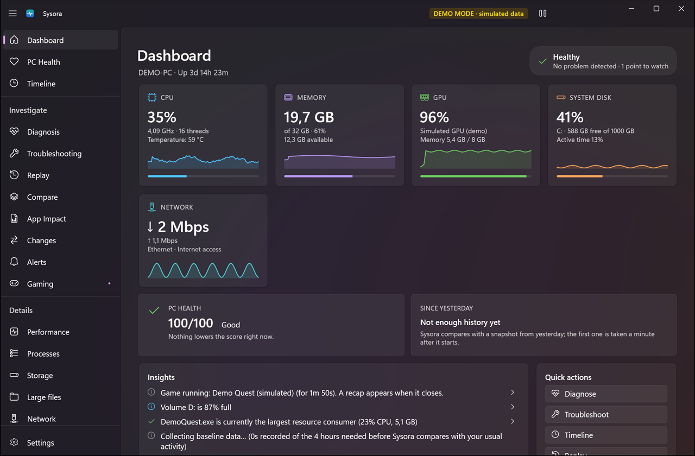
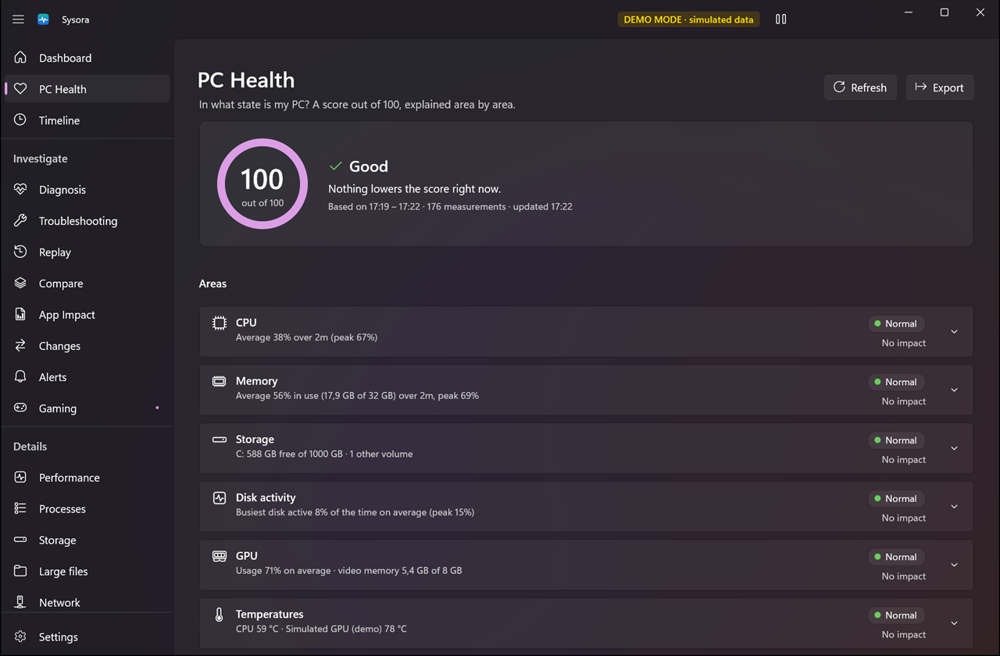
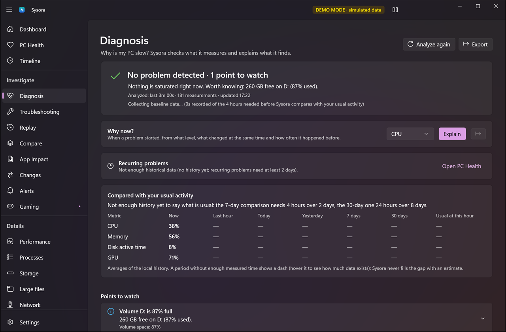
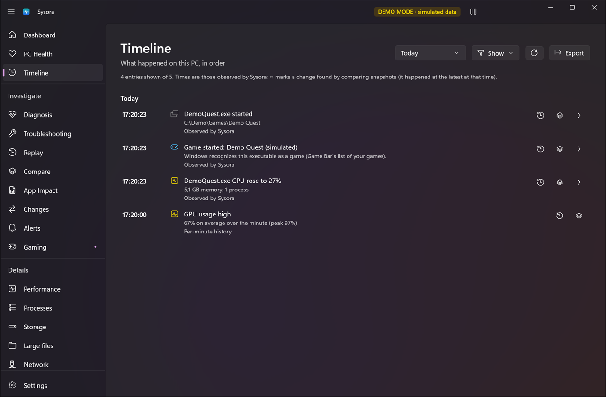
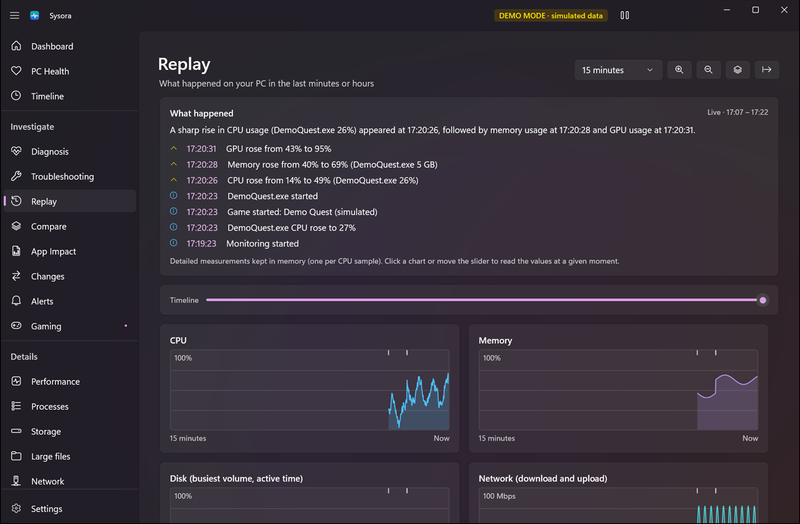
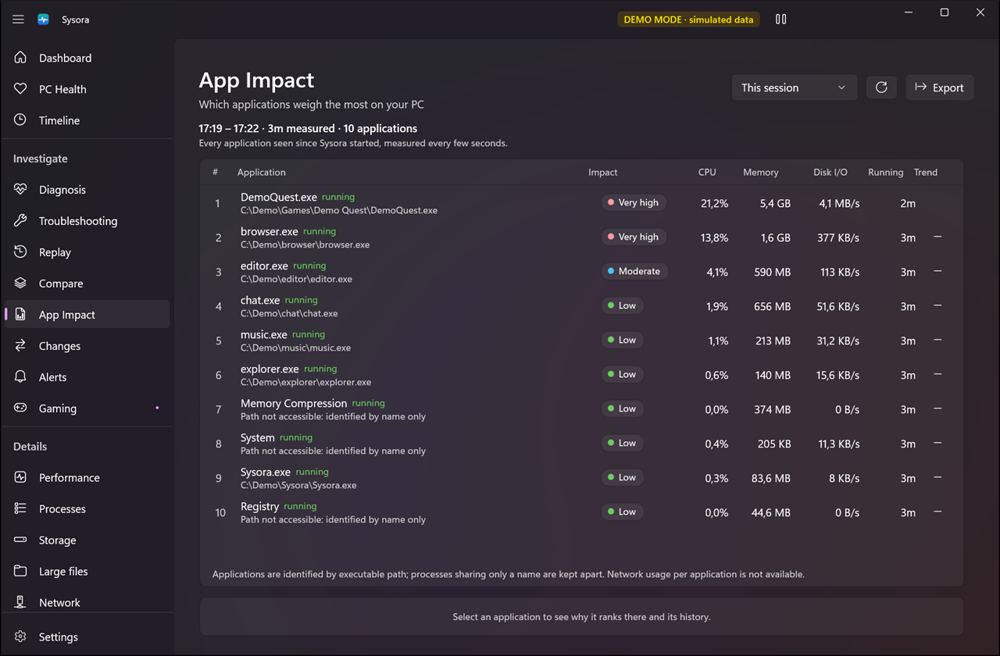
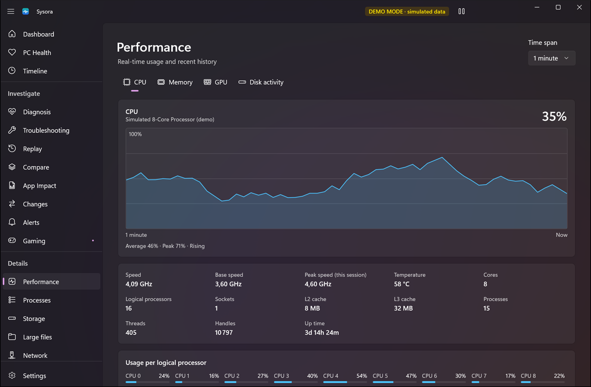
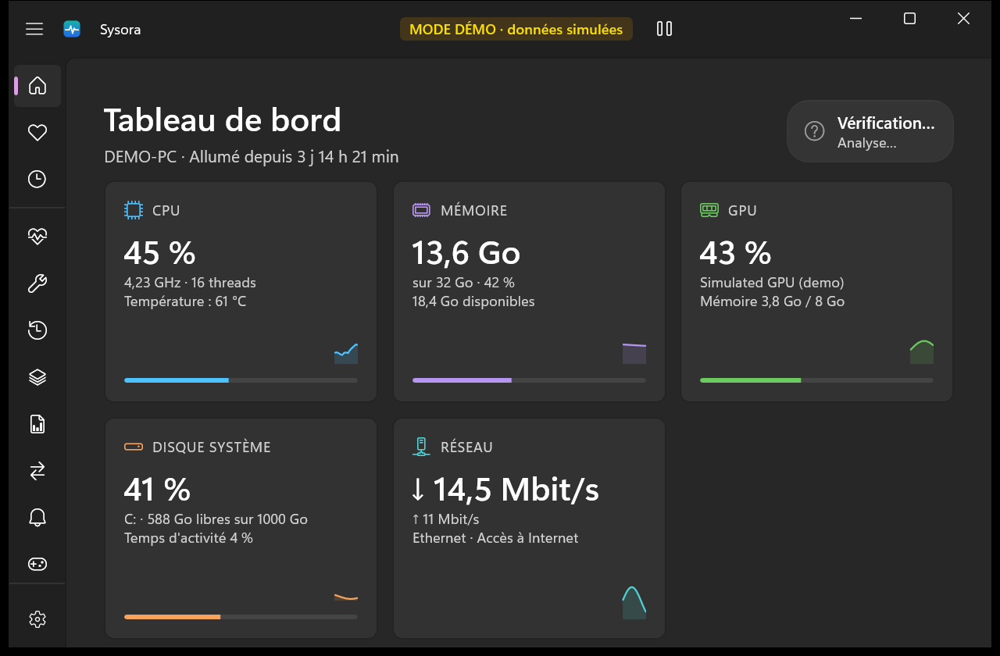
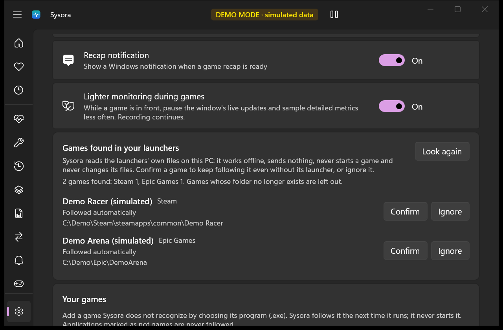

<p align="center">
  
</p>

<h1 align="center">Sysora</h1>

<p align="center">
  <strong>Your PC, Explained.</strong><br />
  A lightweight, local-first Windows system dashboard.
</p>

<p align="center">
  <a href="https://github.com/Elpo55/Sysora/releases/latest"></a>
  <a href="https://github.com/Elpo55/Sysora/actions/workflows/ci.yml"></a>
  
  
  
</p>

Sysora monitors your PC's performance, processes, storage, network and health in real time, and tells you what it
means: why the PC is slow, what changed, which application weighs the most, what happened while you were away. It is a
native WinUI 3 application, in English and French: no account, no server, no telemetry, and it works offline.



> Screenshots use demo mode (`--demo`): every value is simulated, and the app shows a "DEMO MODE" badge.

## What's new in 1.3

- **Sysora in French**: the interface, analyses, diagnoses, alerts and reports, with French formats. Choose the language
  in Settings (Windows language, English or Français).
- **Games installed with a launcher**: games installed with Steam, Epic Games, Riot Client or GOG Galaxy are found from
  the launchers' own files on your PC, offline, and followed automatically. Confirm them or ignore them in Settings.
- **Add a game**: pick any game's program with the Windows file picker, even when it is not running.
- **Ready for other systems**: the shared code now builds and is tested on Windows, Linux and macOS. There is no Linux
  or macOS application yet; see [platforms](docs/platforms.md).

Full details in the [release notes](docs/release-notes/v1.3.0.md). Earlier versions:
[1.2](docs/release-notes/v1.2.0.md), [1.1](docs/release-notes/v1.1.0.md).

## Features

### Understand what happens

- **PC Health**: "In what state is my PC?" A score out of 100 built from CPU, memory, storage, disk activity, GPU,
  temperatures, stability (recurring problems), recent anomalies and your usual behavior. It uses 15-minute averages,
  so a short spike barely counts. An area that cannot be measured is shown as "Not available" and left out of the score.
- **Diagnosis**: "Why is my PC slow?" Deterministic rules check CPU, memory, disks, GPU, network, applications and
  uptime, and explain each finding with the data behind it, a comparison with your usual activity and a confidence
  level.
- **Why now?**: when CPU, memory, disk, GPU or network rises, Sysora finds when it started, from what level, the likely
  contributor (with how much of the increase it accounts for), what happened at the same time and how often it happened
  before. Every statement is labeled *observed*, *inferred* or *unknown*; a cause is never stated as certain.
- **Usual activity**: the current activity compared with the last hour, today, yesterday, the last 7 and 30 days and
  the usual level at this hour, once enough history exists.
- **Timeline**: applications started and closed, games, alerts, spikes and returns to normal, detected changes, sleep,
  network and devices, investigations. Each entry opens Replay at that moment, a before / after comparison or the page
  with more context.
- **Replay**: look back at the last minutes (every second) or hours (per minute): charts with a cursor, the values and
  applications at any moment, events, and a summary of what happened.
- **Compare (before / after)**: now vs 1 hour ago, now vs yesterday, today vs yesterday, before / during / after a game,
  a game vs the previous one, before vs after any moment, or two moments.

### Find the cause

- **App Impact**: which applications weigh the most on your PC, this session or over days, with an explainable impact
  score (CPU, memory and disk I/O weighted by running time), trends and per-application history.
- **Changes** and **Since yesterday**: applications installed, removed or updated, startup programs, Windows build,
  devices, disk space and activity, from daily snapshots of the PC.
- **Recurring problems**: problems that came back on several days (high CPU or memory, busy disk, an application, lost
  Internet access), with when they tend to happen and the application most often involved.
- **Intelligent alerts**: only for problems that last or are unusual for this PC, one alert per condition, never spam;
  statuses New, Seen and Resolved; optional Windows notifications.
- **Troubleshooting mode**: investigate a problem for 2 to 30 minutes with detailed collection (even with the window
  hidden), then read the anomalies, the applications involved, the correlations, what is unknown and what to try.
- **Large files**: an on-demand, read-only, cancellable scan of a drive or folder for the files taking the most space,
  grouped by type, extension or folder. Sysora never moves, changes or deletes a file.
- **Report export**: PC Health, Diagnosis, Why now, Replay, game recaps, App Impact, Alerts, Changes, comparisons, the
  Timeline, investigations and Large files as a readable HTML page (prints to PDF) or structured JSON.

### Gaming

- **Game detection**: games are followed automatically when Windows recognizes them, when Steam, Epic Games, Riot
  Client or GOG Galaxy reports them as installed (read from the launchers' files on your PC, offline, never changed), or
  when they are installed in a game library folder. Confirm or ignore each launcher game, add any other game by choosing
  its program, and mark any application as not a game.
- **Game recaps**: when the game closes, a recap shows averages and peaks (CPU, GPU, video memory, RAM, disk, network,
  the game's own usage), the limits reached, the likely limiting factor, the busiest background applications and a
  comparison with your previous sessions.
- **FPS is never estimated**: Windows offers no reliable source, so it is shown as "Not available".
- **Out of the way**: while a game is in front, Sysora pauses its own window updates and samples less often.

### Real-time monitoring

- **CPU**: overall and per-logical-processor usage, effective clock speed, base and peak speed, cores, threads, caches
- **Memory**: used, available, committed, system cache, kernel pools
- **GPU**: usage per adapter (busiest engine, the way Task Manager computes it), dedicated and shared memory
- **Storage**: capacity of every local volume, active time and read/write throughput
- **Network**: interfaces, local addresses, download/upload rates, and the connectivity Windows reports
- **Processes**: a simplified task manager with live sorting, search, details, top consumers, and ending a process
  after confirmation
- **System information**: Windows edition and build, processor, graphics, memory, motherboard, BIOS, uptime
- **Real-time charts** from 30 seconds to 30 minutes, and a local history with automatic retention (configurable and
  deletable)

### Light and respectful

- **Monitoring intensity**: Minimal (gaming, battery), Balanced or Detailed, with real differences in sampling, data
  kept and evaluation frequency
- **Sysora's own impact**: its CPU, memory, .NET allocations, disk writes and collection rate, with a CPU budget it
  enforces on itself
- **Notification area**: close to the tray, pause and resume, start with Windows; pending history is saved before the
  PC sleeps and every value is refreshed when it wakes up
- **Light, dark and system themes** with the Windows 11 look (Mica, Fluent controls)
- **English and French**, with dates and numbers in your Windows regional format
- **No account, no telemetry**: nothing is ever uploaded

## Screenshots

| | |
| --- | --- |
|  |  |
| **PC Health**: every point taken off is explained | **Diagnosis**: why the PC is slow, why now, usual activity |
|  |  |
| **Timeline**: what happened, in order | **Replay**: the last minutes or hours, second by second |
|  |  |
| **App Impact**: which applications weigh the most | **Performance**: real-time charts and details |
|  |  |
| **En français**: the whole application, with French formats | **Games**: found in Steam, Epic Games, Riot Client and GOG Galaxy |

## Privacy

Sysora is local-first.

- No telemetry is enabled by default.
- No account is required.
- No system metrics are uploaded.

Sysora never opens a network connection. "Internet available" comes from Windows' own connectivity checks, so Sysora
generates no network traffic to measure it. Settings, logs and the local history (performance, application names,
alerts, detected changes, game sessions, investigations) are stored in `%LOCALAPPDATA%\Sysora` and stay on your PC.
History recording can be turned off and the history deleted from Settings.

## Accuracy

Sysora only shows values Windows actually provides. Anything that isn't available on a given machine appears as
**"Not available"**, never as an invented number. For example, CPU temperature can't be read through any documented
Windows API without a third-party kernel driver, which Sysora deliberately does not install. See
[docs/architecture.md](docs/architecture.md#where-the-numbers-come-from) for the data source of every metric and
[its limitations](docs/architecture.md#limitations).

## Install

Download the installer from the [latest release](https://github.com/Elpo55/Sysora/releases/latest):
`Sysora-<version>-setup-x64.exe` (or `-arm64` for Windows on ARM), run it, then start Sysora from the Start menu. It
installs for all users by default; choose **Install for me only** on the first screen to install without administrator
rights. Installing a new version over an older one (including PulseDesk, Sysora's former name) keeps your settings and
history. Uninstall it from Settings › Apps.

The installer is not code-signed yet: if SmartScreen shows "Windows protected your PC", click **More info**, then
**Run anyway**, and compare the file with `SHA256SUMS.txt` from the release.

## Requirements

- Windows 10 version 1809 (build 17763) or later, Windows 11 recommended; x64 or ARM64
- To build: the [.NET 10 SDK](https://dotnet.microsoft.com/download/dotnet/10.0).
  Visual Studio is optional. Everything else (Windows App SDK, WinUI 3) comes from NuGet.

## Linux and macOS

Sysora is a Windows application: **there is no Linux or macOS version yet**. The shared code (analysis, history,
settings, translations) and the first Linux and macOS data sources are built and tested on those systems by CI, as the
groundwork for a future version. [docs/platforms.md](docs/platforms.md) lists, feature by feature, what works on each
system and how it was checked.

## Build

```powershell
git clone https://github.com/Elpo55/Sysora.git
cd Sysora
dotnet build Sysora.slnx -c Release
```

## Run

```powershell
dotnet run --project src/Sysora.App -c Release
```

The app is unpackaged and bundles the Windows App SDK runtime, so no runtime installation or signing certificate is
needed. Useful options:

| Option | Effect |
| --- | --- |
| `--demo` | Simulated metrics (clearly labeled), for UI work and screenshots; settings changes last only for the session |
| `--tray` | Start hidden in the notification area |
| `--language=fr` | Use a language for this run only (`en` or `fr`), without changing the setting |
| `--page=Processes` | Open on a given page (`Dashboard`, `PcHealth`, `Timeline`, `Diagnosis`, `Troubleshooting`, `Replay`, `Compare`, `AppImpact`, `Changes`, `Alerts`, `Gaming`, `Performance`, `Processes`, `Storage`, `LargeFiles`, `Network`, `System`, `Settings`) |

Pass them after `--` with `dotnet run`, for example `dotnet run --project src/Sysora.App -- --demo`.

## Test

```powershell
dotnet test --project src/Sysora.Tests
```

The unit tests cover the Core logic (ring buffers, history, formatting, trends, thresholds, anomaly detection, health,
settings serialization, the monitoring loop, diagnosis, alerts, app impact, change detection, replay, PC Health, why
now, comparisons, since yesterday, recurring problems, timeline, troubleshooting, monitoring intensity, Sysora's own
impact, insights, large-file scans, reports, games and launcher files, translations and demo mode), the SQLite history
(in memory and on disk, including schema upgrades) and the parsing helpers of the Windows, Linux and macOS layers. They
use simulated data, a fixed culture and fake clocks, and never depend on the machine's hardware. CI runs them on
Windows, Ubuntu and macOS.

## Project structure

```
src/
  Sysora.App/                     WinUI 3 application: views, view models, controls, UI services
  Sysora.Core/                    Models, interfaces, monitoring loop, health, history, analysis, diagnosis,
                                  alerts, change detection, games, settings (any system)
  Sysora.Localization/            English and French texts, language selection (any system)
  Sysora.Infrastructure/          Settings file, SQLite history, logs, large-file scan (any system);
                                  Linux and macOS adapters
  Sysora.Infrastructure.Windows/  Windows adapters: performance counters, native APIs, registry, games
  Sysora.Tests/                   Unit tests
docs/                             Architecture, development and platform guides, release notes
installer/                        Inno Setup script of the Windows installer
```

Read [docs/architecture.md](docs/architecture.md) for the design, [docs/development.md](docs/development.md) for
the commands and conventions, and [CONTRIBUTING.md](CONTRIBUTING.md) to contribute. Corrections to the French texts
and new translations are welcome.

## Roadmap

1. **Advanced GPU metrics**: temperature and clock speed through the documented D3DKMT adapter statistics, where
   drivers expose them
2. Per-process network usage (optional, administrator-level event tracing), change detection for drivers, services
   and scheduled tasks
3. Alerts for a specific application, and alert snoozing
4. Processes, disk activity and network on Linux and macOS, then an interface for those systems
   ([evaluation](docs/platforms.md#a-linux-and-macos-interface))
5. An optional local API (for example for Windows Orchestrator)

## License

[MIT](LICENSE)
