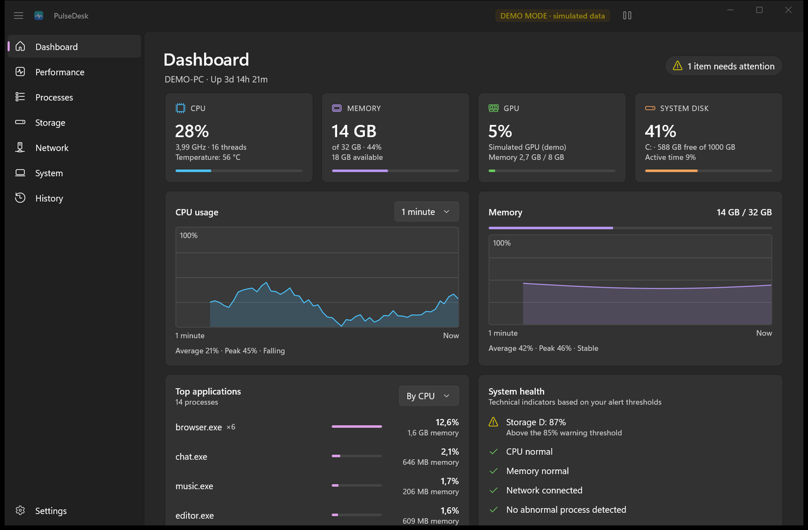
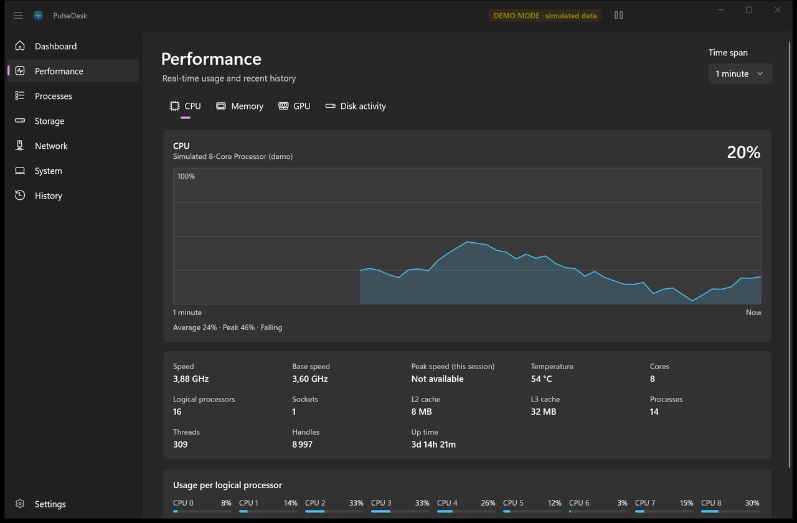
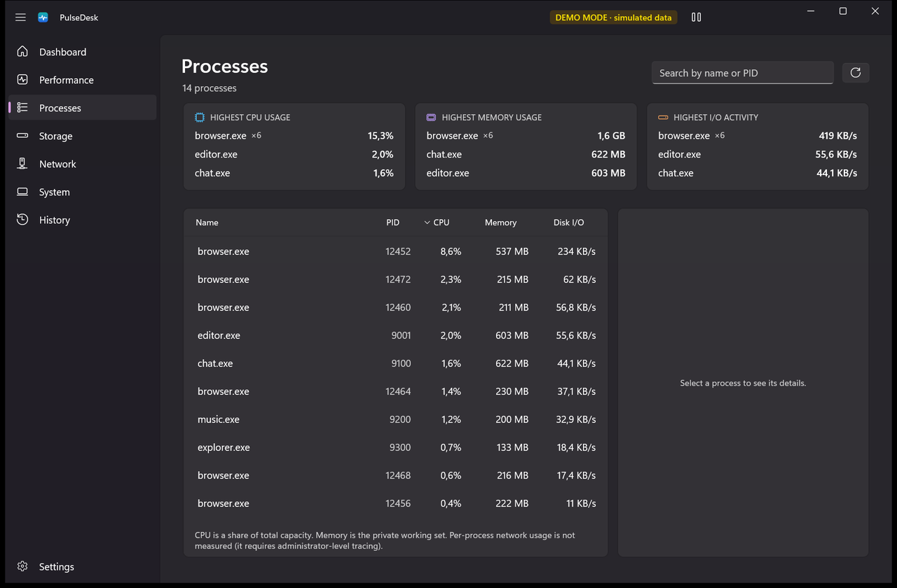
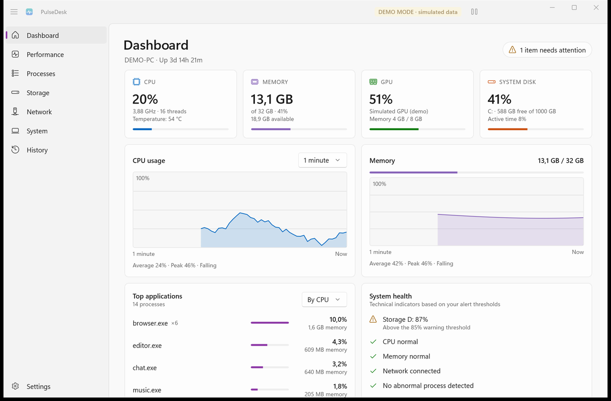

<p align="center">
  
</p>

<h1 align="center">PulseDesk</h1>

<p align="center">
  <strong>A lightweight, local-first Windows system dashboard.</strong>
</p>

<p align="center">
  <a href="https://github.com/Elpo55/PulseDesk/actions/workflows/ci.yml"></a>
  
  
  
</p>

PulseDesk is a modern, local-first Windows dashboard for monitoring system performance, processes,
storage, network activity and system health in real time. It is a native WinUI 3 application: no
account, no server, no telemetry, and it works offline.



> Screenshots use demo mode (`--demo`): every value is simulated, and the app shows a "DEMO MODE" badge.

## Features

- **CPU monitoring**: overall and per-logical-processor usage, effective clock speed, base and peak speed, cores, threads, caches
- **Memory monitoring**: used, available, committed, system cache, kernel pools
- **GPU monitoring**: usage per adapter (busiest engine, the way Task Manager computes it), dedicated and shared memory, busiest engines
- **Storage monitoring**: capacity of every local volume, plus active time and read/write throughput
- **Network monitoring**: interfaces, local addresses, download/upload rates, and the connectivity Windows reports
- **Process monitoring**: a simplified task manager with live sorting, search, details, top consumers, and ending a process after confirmation
- **System information**: Windows edition and build, processor, graphics, memory, motherboard, BIOS, uptime
- **Health indicators**: CPU and memory alerts must persist for a configurable time before they're reported, so short spikes don't trigger them; thresholds are configurable
- **Real-time charts**: 30 seconds to 30 minutes of history, kept in fixed-size in-memory ring buffers
- **Windows tray support**: close to the notification area, pause/resume from the tray, start with Windows
- **Light, dark and system themes** with the Windows 11 look (Mica, Fluent controls)
- **No account**
- **No telemetry by default**: nothing is ever uploaded

<details>
<summary>More screenshots</summary>





</details>

## Privacy

PulseDesk is local-first.

- No telemetry is enabled by default.
- No account is required.
- No system metrics are uploaded.

PulseDesk never opens a network connection. "Internet available" comes from Windows' own
connectivity checks, so PulseDesk generates no network traffic to measure it. Settings and logs are stored in
`%LOCALAPPDATA%\PulseDesk` and stay on your PC.

## Accuracy

PulseDesk only shows values Windows actually provides. Anything that isn't available on a given machine
appears as **"Not available"**, never as an invented number. For example, CPU temperature can't be read
through any documented Windows API without a third-party kernel driver, which PulseDesk deliberately does not
install. See [docs/architecture.md](docs/architecture.md#where-the-numbers-come-from) for the data source
of every metric.

## Requirements

- Windows 10 version 1809 (build 17763) or later, Windows 11 recommended; x64 or ARM64
- To build: the [.NET 10 SDK](https://dotnet.microsoft.com/download/dotnet/10.0).
  Visual Studio is optional. Everything else (Windows App SDK, WinUI 3) comes from NuGet.

## Build

```powershell
git clone https://github.com/Elpo55/PulseDesk.git
cd PulseDesk
dotnet build PulseDesk.slnx -c Release
```

## Run

```powershell
dotnet run --project src/PulseDesk.App -c Release
```

The app is unpackaged and bundles the Windows App SDK runtime, so no runtime installation or signing
certificate is needed. Useful options:

| Option | Effect |
| --- | --- |
| `--demo` | Simulated metrics (clearly labeled), for UI work and screenshots |
| `--tray` | Start hidden in the notification area |
| `--page=Processes` | Open on a given page (`Dashboard`, `Performance`, `Processes`, `Storage`, `Network`, `System`, `History`, `Settings`) |

Pass them after `--` with `dotnet run`, for example `dotnet run --project src/PulseDesk.App -- --demo`.

## Test

```powershell
dotnet test --project src/PulseDesk.Tests
```

The unit tests cover the Core logic (ring buffers, history, formatting, trends, thresholds, anomaly
detection, health, settings serialization, the monitoring loop) and the pure parsing helpers of the
Windows layer. They use simulated data and never depend on the machine's hardware.

## Project structure

```
src/
  PulseDesk.App/             WinUI 3 application: views, view models, controls, UI services
  PulseDesk.Core/            Models, interfaces, monitoring loop, health, settings (no Windows dependency)
  PulseDesk.Infrastructure/  Windows implementations: performance counters, native APIs, registry, files
  PulseDesk.Tests/           Unit tests
docs/                        Architecture and development guides
```

Read [docs/architecture.md](docs/architecture.md) for the design and [docs/development.md](docs/development.md)
to contribute.

## Roadmap

Version 0.1 is the MVP. Planned next, in order:

1. **History**: a local event log ("CPU usage exceeded 90%", "Disk C: exceeded 85%", "System resumed from
   sleep") with filters and retention settings
2. **Notifications** when a threshold stays exceeded (can be turned off)
3. **Advanced GPU metrics**: temperature and clock speed through the documented D3DKMT adapter statistics, where drivers expose them
4. **Storage analyzer**: on-demand, read-only folder sizes
5. Per-process network usage, CSV/JSON export, monitoring profiles, an optional local API (for example for
   Windows Orchestrator)

## License

[MIT](LICENSE)
