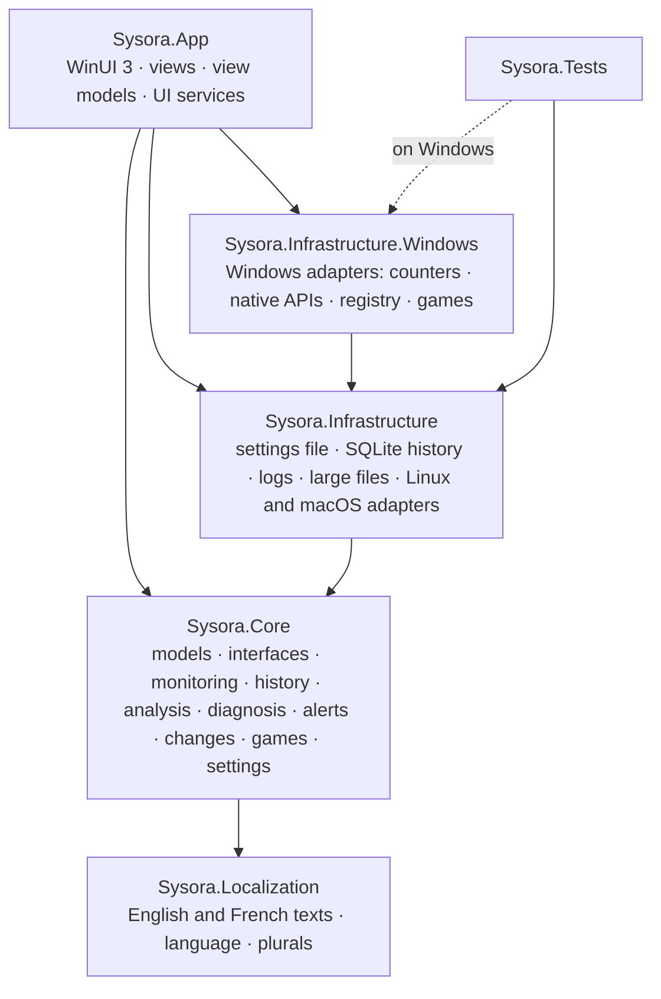
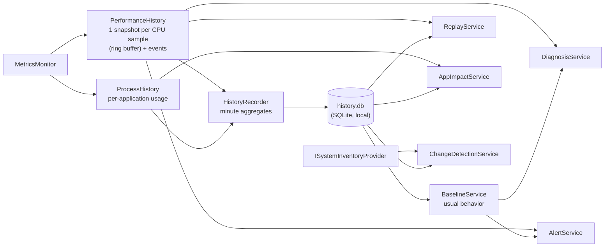
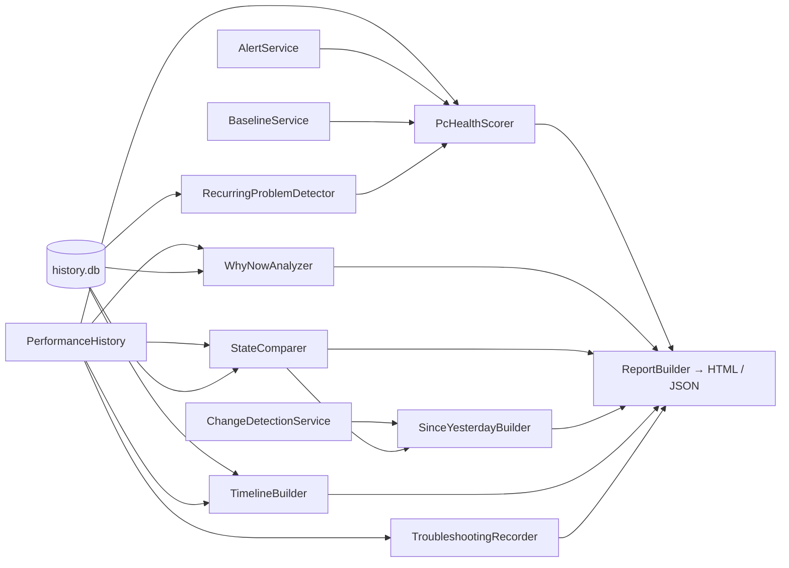

# Architecture

Sysora is split into five projects with a strict dependency rule, plus tests.



- **Core** depends on nothing Windows-specific (it targets plain `net10.0`): no WinUI, no P/Invoke, no registry.
  It defines the interfaces (`ICpuMetricProvider`, `IMetricsMonitor`, `IProcessManager`...) and contains
  all logic that can be tested without hardware.
- **Localization** holds every text shown to the user, in English and French (see [Languages](#languages)).
- **Infrastructure** targets plain `net10.0` too: what works on every system (settings file, SQLite history, logs,
  large-file scan, data folders) and the first Linux and macOS adapters. It never references WinUI.
- **Infrastructure.Windows** implements the Core interfaces with Windows APIs. Its types keep the
  `Sysora.Infrastructure.*` namespaces of the layer they extend.
- **App** is the only place that knows them all. `Services/AppHost.cs` is the composition root: the single
  place that decides which implementation backs each interface (Windows providers normally, simulated
  ones with `--demo`).

What runs on which system, and how it was checked, is in [platforms.md](platforms.md).

The UI never reads system counters itself:

```
View (XAML) → ViewModel → UiMetricsHub / service → Core interface → Infrastructure → Windows
```

Views contain no logic beyond wiring. View models never call `System.Diagnostics.Process` or any Windows API,
and never touch the history database: they go through Core services, which use `IHistoryRepository`.

## Monitoring pipeline

```mermaid
sequenceDiagram
    participant Loop as MetricsMonitor (background loop)
    participant P as Providers (CPU, memory, GPU...)
    participant H as MetricHistory (ring buffers)
    participant Health as HealthService
    participant Hub as UiMetricsHub
    participant VM as Active view model (UI thread)
    Loop->>P: collect due metrics concurrently
    P-->>Loop: immutable records
    Loop->>H: append chart samples
    Loop-->>Health: MetricsUpdated (snapshot)
    Loop-->>Hub: MetricsUpdated (snapshot)
    Hub->>VM: one coalesced update at low priority
```

`MetricsMonitor` (Core) is a single background loop. It:

1. asks `MetricSchedule` which metrics are due (each has its own interval: CPU 1 s, processes 2 s,
   storage 15 s...), coalescing those due within 30 ms;
2. collects them concurrently, each with a timeout, and never calls a provider while its previous call
   is still running;
3. publishes a new immutable `SystemSnapshot`, records chart samples in `MetricHistory`, and raises
   `MetricsUpdated`;
4. sleeps until the next metric is due. There's no busy loop and no timer per metric, and `StopAsync`
   leaves nothing running.

A provider that throws doesn't stop the others: its metric is flagged in `SystemSnapshot.Unavailable` and
the UI shows "Not available". The first failure is logged in full; repeats are logged at debug level only.

### Keeping Sysora light

| Mechanism | Where |
| --- | --- |
| One loop, per-metric intervals, coalesced wake-ups | `MetricSchedule`, `MetricsMonitor` |
| Background mode: processes, GPU, disk and network sampled 5× less often while the window is hidden or minimized | `MetricsMonitor.SetActivity`, `ApplicationShell` |
| History and per-application tracking only append to memory on the loop; SQLite writes are batched once a minute by one background task | `PerformanceHistory`, `ProcessHistory`, `HistoryRecorder` |
| Alerts evaluated every 5 s on the thread pool; diagnosis, impact and replay computed only while their page is visible | `AlertService`, page view models |
| No UI work at all while hidden; at most one queued UI update at a time, at low priority | `UiMetricsHub` |
| CPU budget: if Sysora exceeds it (default 2% of total capacity), every interval is stretched automatically | `SelfUsageGovernor` |
| Bounded memory: fixed-size ring buffers sized for 30 minutes at the fastest interval | `RingBuffer<T>`, `MetricSeries` |
| One kernel call for all processes (`NtQuerySystemInformation`), reusable native buffers, allocation-free counter parsing | `ProcessSnapshotReader`, `PdhCounter.VisitInstances` |
| Charts downsampled to about one point per two pixels (LTTB) | `Downsampler`, `TimeSeriesChart` |
| Lightweight bars (render transform, no layout) and stable list rows (re-sorting changes content, not items) | `UsageBar`, `ProcessesViewModel.Rows` |
| Only the visible page listens to updates | `PageViewModel.Activate/Deactivate` |
| While a game runs and Sysora is not the active window: no UI updates, background sampling | `ApplicationShell.UpdateActivity`, `GamingSettings.ReduceMonitoringDuringGames` |
| Game sessions read the existing snapshots (no extra collection); classification cached per executable; bounded timeline | `GameSessionTracker` |
| Monitoring intensity: Minimal multiplies intervals (×2 real time, ×3 processes/GPU/disks, ×4 free space), keeps 3 applications per sample instead of 5 and evaluates alerts every 10 s; Detailed halves them (never below 0.5 s, 1 s for processes) and keeps 8 | `MonitoringProfile`, `MetricsMonitor`, `PerformanceHistory`, `AlertService` |
| Sysora measures its own CPU, memory, allocations, garbage collections, writes and collection rounds every 10 s (counter reads only) and warns once if it stays above its CPU budget for a minute | `MetricsMonitor.MeasureSelf`, `SelfImpactAssessor` |
| Advanced analyses run only when their page or the dashboard is visible, off the UI thread, with caches (recurring problems 10 min, since yesterday 30 min) | `PcHealthService`, `RecurringProblemService`, `SinceYesterdayService` |
| Large-file scans run only on request, one at a time, cancellable, at background priority; the last result is kept in memory | `LargeFileService`, `FileSystemLargeFileScanner` |
| A counter with no valid value for one sample (wrap-around) skips that sample instead of reporting the metric unavailable | `MetricSampleSkippedException`, `MetricsMonitor` |
| Released builds are precompiled (ReadyToRun): the window opens sooner and code first run minutes after start costs no JIT time | `Sysora.App.csproj` |

Measured on a Ryzen 9 7845HX laptop (24 logical processors), Release build: in the background
Sysora uses about 1% of one core (0.05% of total capacity). With the window open, a page uses
1.5–4% of one core, including rendering.

## Where the numbers come from

| Metric | Source | Notes |
| --- | --- | --- |
| CPU usage | PDH `\Processor Information(*)\% Processor Utility` | Same counter as Task Manager; capped at 100% |
| CPU speed | PDH `Processor Frequency` × `% Processor Performance` | Task Manager's method; reflects boost clocks |
| CPU base speed | `CallNtPowerInformation(ProcessorInformation)` | Highest rated frequency (hybrid CPUs) |
| Cores, sockets, caches | `GetLogicalProcessorInformationEx` | |
| CPU temperature | — | Not available: no documented API without a kernel driver |
| Memory | `GlobalMemoryStatusEx`, `GetPerformanceInfo` | Commit charge, system cache, kernel pools |
| GPU usage | PDH `\GPU Engine(*)\Utilization Percentage` | Sum per engine, max over engines (Task Manager's method) |
| GPU memory | PDH `\GPU Adapter Memory(*)\Dedicated/Shared Usage`, DXGI | Names and totals from `IDXGIAdapter1::GetDesc1` |
| Volumes | `GetDiskFreeSpaceEx` / `GetVolumeInformation` (`DriveInfo`) | Network drives skipped (can block) |
| Disk activity | PDH `\LogicalDisk(*)\% Idle Time`, `Disk Read/Write Bytes/sec` | Active time = 100 − idle |
| Network | IP Helper (`System.Net.NetworkInformation`), WinRT `NetworkInformation` | Filter drivers and WAN miniports excluded; Internet status as determined by Windows |
| Processes | `NtQuerySystemInformation(SystemProcessInformation)` | CPU, private working set, I/O, threads, handles without opening any process |
| Process path, version | `QueryFullProcessImageName`, `FileVersionInfo` | "Access denied" shown for protected processes |
| OS, firmware | Registry (`CurrentVersion`, `HARDWARE\DESCRIPTION\System\BIOS`) | "Windows 10" in the registry is corrected to "Windows 11" from the build number; OEM placeholder strings are hidden |
| Uptime | `GetTickCount64` | Includes sleep, like Task Manager |
| Application identity | `QueryFullProcessImageName` (once per new process) | PID reuse checked with `GetProcessTimes`; name only when access is denied |
| Installed applications | Uninstall registry keys, `PackageManager.FindPackagesForUser` | Read-only; system components and updates excluded |
| Startup programs | `Run` keys, Startup folders, `StartupApproved` | Enabled state as set in Settings › Apps › Startup |
| Network adapters (Changes) | `NetworkInterface.GetAllNetworkInterfaces` | Physical types only; virtual adapters excluded |
| Per-application network | — | Not available: requires administrator-level event tracing |
| GPU usage per process (games) | PDH `\GPU Engine(*)\Utilization Percentage` (instance names carry `pid_N`) | Busiest engine per process, like Task Manager |
| Games recognized by Windows | `HKCU\System\GameConfigStore\Children\*\MatchedExeFullPath` | Game Bar's list for the user; read-only |
| Games installed with Steam | `HKCU\Software\Valve\Steam\SteamPath`, `steamapps\libraryfolders.vdf`, `appmanifest_*.acf` | Every library folder; fully installed apps only; tools (Proton, runtimes, redistributables) excluded |
| Games installed with Epic Games | `%ProgramData%\Epic\EpicGamesLauncher\Data\Manifests\*.item` | Applications in the "games" category whose installation is complete |
| Games installed with Riot Client | `%ProgramData%\Riot Games\Metadata\*\*.product_settings.yaml` | VALORANT, League of Legends, Teamfight Tactics, Legends of Runeterra, 2XKO; the Riot Client itself excluded |
| Games installed with GOG Galaxy | `HKLM\SOFTWARE\WOW6432Node\GOG.com\Games\*` (`gameName`, `path`) | Read-only |
| Frame rate (FPS) | — | Not available: requires administrator-level event tracing or hooking into the game |
| Sleep and resume | `PowerRegisterSuspendResumeNotification` | Pending history written before sleep; all metrics refreshed on resume |
| Free space over time (Windows volume) | `GetDiskFreeSpaceEx`, kept in the per-minute history | Used by Compare; history written by earlier versions has no value (shown as not available) |
| Application launches | Process start time and session from `NtQuerySystemInformation` | Reported when confirmed at the next sample, in a user session, outside the Windows folder |
| Large files | Folder listings (`FindFirstFileEx` through `FileSystemEnumerable`) | Logical size, as Explorer shows it; nothing is opened |
| Sysora's own usage | `Environment.CpuUsage`, `GC` counters, its own entry in the process list | Measured every 10 seconds |

All performance counters are added by their English names (`PdhAddEnglishCounter`), so Sysora works
on every Windows display language.

## Health and anomaly detection

`HealthEvaluator` turns snapshots into indicators using the user's thresholds. CPU, memory and
per-application CPU conditions go through `SustainedThresholdDetector`, which avoids false positives:

- the value must stay at or above the threshold for the whole duration (30 s for CPU by default);
- any dip below the threshold restarts the wait;
- an active condition clears only below `threshold − hysteresis`, so a value hovering at the limit doesn't flap;
- a gap in the samples (sleep, pause) restarts the wait.

`HealthService` runs the evaluator on every update in the background, independently of the UI. These instant
indicators feed the dashboard's System health panel; the intelligent alerts (see above) are a separate, slower layer
with their own configurable rules.

## From measurements to explanations

Sysora's value is *Monitor → Detect → Explain → Understand*. Five functions sit on top of the monitoring loop:



| Function | Core types | Page |
| --- | --- | --- |
| Diagnosis: "why is my PC slow?" | `IDiagnosisEngine`, `DiagnosisEngine`, `DiagnosisRule`, `DiagnosisService` | Diagnosis |
| Replay: "what happened?" | `IPerformanceHistory`, `ReplayService`, `ReplayNarrator` | Replay |
| App Impact: "which application weighs the most?" | `ProcessHistory`, `IAppImpactAnalyzer`, `AppImpactService` | App Impact |
| Alerts: lasting or unusual conditions | `IAlertEngine`, `AlertEngine`, `AlertRule`, `AlertService` | Alerts |
| Changes: "what changed?" | `IChangeDetectionService`, `BaselineComparer`, `ISystemInventoryProvider` | Changes |
| Gaming: "how did my game session go?" | `GameClassifier`, `IGameLibrary`, `GameSessionTracker`, `GameRecapBuilder`, `GameSessionService` | Gaming |
| Usual activity: now vs hour, day, 7 and 30 days | `UsageComparer`, `UsageComparisonService` | Diagnosis |
| PC Health: "in what state is my PC?" | `PcHealthScorer`, `PcHealthService` | PC Health, Dashboard |
| Why now: "why is this happening now?" | `WhyNowAnalyzer`, `WhyNowService` | Diagnosis |
| Before / after | `StateComparer`, `StateComparisonService` | Compare |
| Since yesterday | `SinceYesterdayBuilder`, `SinceYesterdayService` | Changes, Dashboard |
| Recurring problems | `RecurringProblemDetector`, `RecurringProblemService` | PC Health, Diagnosis |
| Global timeline | `TimelineBuilder`, `TimelineService` | Timeline |
| Troubleshooting mode | `TroubleshootingRecorder`, `TroubleshootingService` | Troubleshooting |
| Large files | `LargeFileScanEngine`, `ILargeFileScanner`, `LargeFileService` | Large files |
| Reports | `ReportBuilder`, `ReportWriter` | every analysis page (Export) |

Principles shared by all of them:

- **Deterministic and explainable.** Rules are plain code with documented thresholds. Every result carries
  `AnalysisEvidence` (what was measured, value, reference, period, sample count, source) and a `ConfidenceLevel`.
  Hypotheses are worded as such; an unknown cause is reported as "Change detected, origin unknown."
- **Never invented.** A metric that is not available is not analyzed (the diagnosis lists it under "Not analyzed").
  Nothing is described as "usual" before the baseline has 4 hours of history.
- **Duration and context, not instant thresholds.** Alerts require a condition to last (5 minutes of high CPU by
  default), compare with the usual range, keep one alert per condition with hysteresis, reopen within a cooldown
  instead of creating a new one, and are limited per hour.
- **Applications are identified by executable path.** Processes sharing only a name (several `Update.exe`) are kept
  apart; protected processes whose path is not accessible are identified by name and flagged as such.

### Advanced analysis

The advanced analysis functions compute on demand from what the services above already keep: none of them adds a
collection or a timer of its own (troubleshooting temporarily raises the collection rate, see below).



- **Observed, inferred, unknown.** Every statement of Why now, recurring problems and investigations is a `Finding` with a
  `FindingBasis`. Correlations ("Likely contributor", "Associated with") carry a confidence; what cannot be observed says so
  ("Cause unknown", "Not available: Windows does not report network usage per application…").
- **PC Health** starts at 100 and each area takes off documented points (shown next to it). Time-based areas use 15-minute
  averages, so a short spike barely moves the score; an area that cannot be measured is not counted.
- **Why now** buckets the in-memory history (and one hour of per-minute averages before it) into 30-second steps, finds where
  the metric left its earlier level, and compares the top applications before and after that moment.
- **Before / after** reads each period from the most detailed source available: per-second measurements in memory, then the
  per-minute history, then hourly summaries. Only metrics measured in both periods are compared.
- **Timeline** merges stored and in-memory events (application launches and closings, games, alerts, connectivity, devices,
  sleep, investigations), detected changes (dated between snapshots, marked ≈) and spikes derived from the per-minute history.
- **Troubleshooting** switches the monitor to the Detailed intensity (`IMetricsMonitor.SetInvestigationMode`) without the
  background slowdown, records each snapshot at a constant cost (bounded timeline, applications and events), and returns to
  the user's intensity when the time is up, when stopped, or when Sysora exits. Reports are kept in the `documents` table.
- **Large files** walks folder listings only (`FileSystemEnumerable`: no file is opened) on a dedicated thread in Windows'
  background mode (lower CPU and I/O priority). Links and junctions are not followed, online-only cloud files are skipped,
  unreadable folders are counted and reported. The largest files are kept in a fixed-size heap.
- **Reports** have readable sections and a `data` element with the complete analysis (source-generated JSON). HTML reports are
  self-contained (no external resource) and print to PDF from any browser.

#### PC Health score

| Area | Measured | Points taken off |
| --- | --- | --- |
| CPU | 15-minute average | 0 below 50%, linear up to 15 at 100% |
| Memory | 15-minute average, commit charge | 0 below 60%, linear up to 20 at 95%; 3 more when the commit charge stays above 90% |
| Storage | Free space of fixed volumes | 16 when the Windows volume is above the critical level, 8 above the warning level (Settings › Health thresholds); 4 per other volume above critical |
| Disk activity | 15-minute average of the busiest disk | 0 below 40%, linear up to 10 at 90% |
| GPU | Usage (informational), dedicated video memory | 5 when video memory is 95% full (a busy GPU alone is normal while gaming) |
| Temperatures | Only when a driver reports them | 5 at 85 °C, 10 at 95 °C |
| Stability | Recurring problems over 7 days | 4 per recurring problem (at most 12), once 2 days of history exist |
| Recent anomalies | Alerts raised in the last 24 hours | 2 per warning, 4 per critical (at most 10); alerts "usual for this PC" take nothing off |
| Usual behavior | 15-minute averages vs the baseline | 3 per metric above max(P95, median + margin) (at most 6), once the baseline is ready |

A score needs 2 minutes of measurements. 85 to 100 is *Good*, 70 to 84 *Fair*, 50 to 69 *Needs attention*, below 50
*Poor*.

#### Monitoring intensity

| Intensity | CPU, memory, network | Processes, GPU, disks | Free space | Applications per sample (per criterion) | Alert evaluation |
| --- | --- | --- | --- | --- | --- |
| Minimal | ×2 | ×3 | ×4 | 3 | 10 s |
| Balanced (default) | ×1 | ×1 | ×1 | 5 | 5 s |
| Detailed | ×0.5 (≥ 0.5 s) | ×0.5 (≥ 1 s) | ×0.5 (≥ 5 s) | 8 | 5 s |

Multipliers apply to the configured intervals; the background slowdown and the CPU budget still apply on top.

### History and storage

- **Short term, in memory**: `PerformanceHistory` keeps one `MetricSnapshot` per CPU sample in a ring buffer sized
  for the replay setting (15 minutes by default) and at least the longest alert window, plus a ring buffer of
  `SystemEvent`s (applications starting to use a lot of CPU or memory, notable applications exiting, connectivity
  changes, volumes, gaps, pauses, alerts).
- **Long term, local**: `HistoryRecorder` aggregates snapshots per minute and application usage per five minutes, and
  a single background task writes them to `%LOCALAPPDATA%\Sysora\history.db` through `IHistoryRepository`
  (`HistoryRepository`, SQLite). Hourly maintenance rolls complete hours up, applies retention (minutes 7 days,
  hours 90 days by default) and keeps the file under 256 MB. Demo mode uses an in-memory database.

### Extending the analysis

- **A diagnosis rule**: derive from `DiagnosisRule`, return a `Normal` result when the area is fine, and add it to
  `DiagnosisEngine.CreateDefaultRules`. Another engine (statistical, for example) implements `IDiagnosisEngine` and is
  registered next to the rule engine in `AppHost`: `DiagnosisService` merges their results.
- **An alert rule**: derive from `AlertRule`, give each condition a stable `Key`, use `Condition(...)` for hysteresis,
  and add the rule to `AlertEngine.CreateDefaultRules` (and its thresholds to `SmartAlertSettings`).
- **A change type**: add it to `ChangeType` and to `BaselineComparer` with a deterministic `ChangeId`.

## Games

`GameClassifier` decides whether a running program is a game, in this order: the user's "not a game" list, the user's
games, Windows system folders (never games), games the user confirmed, games a launcher reports as installed (unless
the user ignored them), games Windows recognizes (Game Bar), then executables inside a game library folder. Launcher
helpers, anti-cheat programs and crash reporters are never games.

`LauncherGameScanner` (Core, pure) reads the launchers' own files from the folders `LauncherLocations` lists: only
folders that exist, never a whole drive, never the network, never a write. A game whose folder no longer exists is left
out. The resulting `InstalledGameIndex` matches a running program to its game by install folder. `WindowsGameLibrary`
finds the folders on Windows (registry and `%ProgramData%`); `UnixLauncherLocations` lists them for Linux and macOS.
The scan runs when game sessions start, every 30 minutes and on "Look again" in Settings.

The user's choices are kept in `GamingSettings`: games added by hand (`AddedGames`, by program path), programs that
are not games (`ExcludedGames`), launcher games ignored (`IgnoredLauncherGames`, by launcher key such as `Steam:730`)
and launcher games confirmed (`ConfirmedGames`, kept with their name and folder so they are still followed if the
launcher is uninstalled). A program the user picks with "Add a game..." is checked by `GameExecutable.Check` (a
program file, that exists, outside the Windows folder) and is never started.

## Languages

Every text shown to the user lives in `Sysora.Localization`: `Strings.resx` (texts produced by Core and Infrastructure:
analyses, diagnoses, alerts, events, reports) and `UiStrings.resx` (the interface), each with a `.fr.resx` French
version. The generated classes are used from C# (`Strings.Diagnosis_...`) and from XAML (`{x:Bind l:UiStrings....}`);
they are in their own project because the XAML compiler runs before resources of the App project are generated.

- `AppLanguage` picks the language: the setting (`GeneralSettings.Language`, empty for "Windows language"), else the
  Windows display language when it is supported, else English. `Program.Main` applies it before anything else, for
  the whole process; changing it in Settings offers to restart Sysora.
- `Text.Format` and `Text.Plural` format texts with the current culture; French plural rules (0 and 1 are singular)
  and French typography (a non-breaking space before `: ; ? !` and inside « ») are applied by the texts themselves.
- Dates and numbers follow the Windows regional format (`CurrentCulture`), not the display language.
- Missing translations fall back to English, and tests check that both languages define the same texts with the same
  placeholders.
- Texts already saved in the history (events, alerts, detected changes) stay in the language they were recorded in.
  Logic never reads translated text back: identities are stored separately (`Alert.AppName`, application keys,
  language-neutral change IDs).

## Settings

`AppSettings` is an immutable record tree serialized with source-generated `System.Text.Json`
(`SettingsSerializer`). `SettingsValidator` clamps every value into a safe range, so a hand-edited or
outdated file can never make Sysora sample every millisecond. `SettingsService` validates each change,
raises `Changed` and writes the file 500 ms after the last change. `JsonFileSettingsStore` writes the file
atomically (temporary file, then replace). A corrupt file is set aside, and the defaults are used.

## Application shell

- `Program.cs` enforces a single instance per user (`AppInstance`): launching Sysora again brings the
  running window to the front.
- `ApplicationShell` owns the window life cycle: initial visibility (`--tray`, "Start minimized" and
  "Start in tray" when launched at sign-in), close behavior (quit or minimize to tray), background mode,
  and the tray icon (`Services/Tray`, a small `Shell_NotifyIcon` wrapper).
- Start with Windows uses the documented per-user Run key, writing only Sysora's own value. The
  setting also reflects whether the user disabled it in *Settings › Apps › Startup*.
- Shutdown is ordered: stop the monitoring loop, flush settings, dispose providers (PDH queries, native
  buffers), flush logs, exit.

## Theme

All colors are defined once, in `Themes/Colors.xaml` (light, dark and high-contrast dictionaries).
Pages use `{ThemeResource}` keys or the standard Fluent brushes. `ThemeService` applies the System,
Light or Dark preference to the window content and the caption buttons.

## Logging

`FileLoggerProvider` (Infrastructure) writes daily files to `%LOCALAPPDATA%\Sysora\Logs` through a
bounded queue drained by a background writer, so logging never blocks the caller. Files are kept for
14 days and capped at 10 MB each. The level (Debug, Information, Warning, Error) can be changed in Settings.

## Extending Sysora

### Adding a metric

1. Add a model record in `Core/Models` and a property to `SystemSnapshot`.
2. Declare a provider interface in `Core/Interfaces/IMetricProvider.cs`.
3. Implement it in Infrastructure, plus a simulated version in `Core/Simulation`.
4. Add the provider to `MetricProviders`, give it a `MetricKind` and a `MetricSource` in `MetricsMonitor`,
   and an interval in `ConfigureSchedule`.
5. Register it in `AppHost`, then display it from a view model.

The dashboard and the other pages don't need to change to keep working.

### Planned modules

The architecture leaves room for plugins or a local API. A future integration with Windows Orchestrator ("if CPU > 90%
for 30 s, run a scenario") would consume `AlertService.AlertRaised` or `IMetricsMonitor.MetricsUpdated`, without
touching the UI.

## Limitations

- **Network usage per application** is not available: Windows does not expose it without administrator-level event
  tracing. Per-process I/O combines files, devices and network and cannot be split by disk.
- **Temperatures** are shown only when a driver reports them; there is no documented API without a kernel driver.
- **FPS** is never shown: Windows exposes frame rates only through administrator-level event tracing or by hooking into
  the game.
- **Usual behavior** needs 4 hours of history (7-day window, last 15 minutes excluded); recurring problems need 2 days.
  Until then nothing is called "unusual" or "recurring".
- **Long-term application history** keeps the most significant applications of each five-minute period (up to about 75):
  figures for minor applications over days are lower bounds.
- **Application launches** are detected from process samples (every 2 s by default): an application that ran for less
  than one interval is not reported.
- **Changes** do not cover drivers, services, scheduled tasks or individual files. A change is dated between two
  snapshots (every 6 hours, plus one kept per day), except installs whose installer recorded a date.
- **Application identity**: protected processes (system services, other users' processes when Sysora is not elevated)
  are identified by name only, and the UI says so.
- **Replay** keeps per-second data in memory only (it is lost when Sysora exits); longer periods use per-minute
  averages, with applications per five minutes.
- **Large files** reports logical sizes, as File Explorer does; compressed or sparse files may use less space on disk.
- **Uptime**: with Fast Startup, "Shut down" does not reset the uptime counter.

## Naming note

The `SystemInfo` folders are not named `System`: a namespace ending in `.System` would shadow the `System`
namespace in every Infrastructure file. For the same reason the Windows-only tests are in `WindowsOnly`, not `Windows`.
