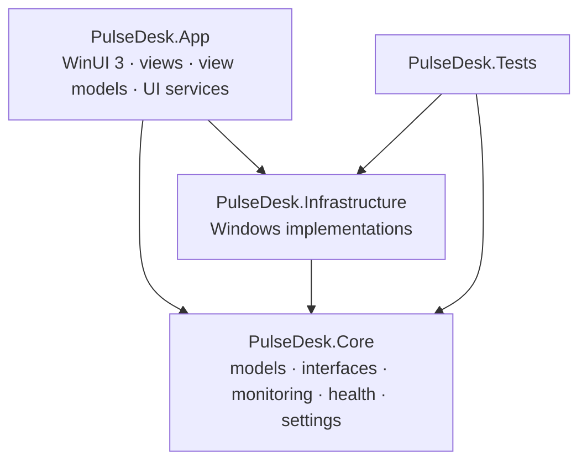

# Architecture

PulseDesk is split into three projects with a strict dependency rule, plus tests.



- **Core** depends on nothing Windows-specific (it targets plain `net10.0`): no WinUI, no P/Invoke, no registry.
  It defines the interfaces (`ICpuMetricProvider`, `IMetricsMonitor`, `IProcessManager`...) and contains
  all logic that can be tested without hardware.
- **Infrastructure** implements the Core interfaces with Windows APIs. It never references WinUI.
- **App** is the only place that knows both. `Services/AppHost.cs` is the composition root: the single
  place that decides which implementation backs each interface (Windows providers normally, simulated
  ones with `--demo`).

The UI never reads system counters itself:

```
View (XAML) → ViewModel → UiMetricsHub / service → Core interface → Infrastructure → Windows
```

Views contain no logic beyond wiring. View models never call `System.Diagnostics.Process` or any Windows API.

## Monitoring pipeline

```mermaid
sequenceDiagram
    participant Loop as MetricsMonitor (background loop)
    participant P as Providers (CPU, memory, GPU...)
    participant H as MetricHistory (ring buffers)
    participant Health as HealthService
    participant Hub as UiMetricsHub
    participant VM as Active view model (UI thread)
    Loop->>P: collect due metrics concurrently
    P-->>Loop: immutable records
    Loop->>H: append chart samples
    Loop-->>Health: MetricsUpdated (snapshot)
    Loop-->>Hub: MetricsUpdated (snapshot)
    Hub->>VM: one coalesced update at low priority
```

`MetricsMonitor` (Core) is a single background loop. It:

1. asks `MetricSchedule` which metrics are due (each has its own interval: CPU 1 s, processes 2 s,
   storage 15 s...), coalescing those due within 30 ms;
2. collects them concurrently, each with a timeout, and never calls a provider while its previous call
   is still running;
3. publishes a new immutable `SystemSnapshot`, records chart samples in `MetricHistory`, and raises
   `MetricsUpdated`;
4. sleeps until the next metric is due. There's no busy loop and no timer per metric, and `StopAsync`
   leaves nothing running.

A provider that throws doesn't stop the others: its metric is flagged in `SystemSnapshot.Unavailable` and
the UI shows "Not available". The first failure is logged in full; repeats are logged at debug level only.

### Keeping PulseDesk light

| Mechanism | Where |
| --- | --- |
| One loop, per-metric intervals, coalesced wake-ups | `MetricSchedule`, `MetricsMonitor` |
| Background mode: processes, GPU, disk and network sampled 5× less often while the window is hidden or minimized | `MetricsMonitor.SetActivity`, `ApplicationShell` |
| No UI work at all while hidden; at most one queued UI update at a time, at low priority | `UiMetricsHub` |
| CPU budget: if PulseDesk exceeds it (default 2% of total capacity), every interval is stretched automatically | `SelfUsageGovernor` |
| Bounded memory: fixed-size ring buffers sized for 30 minutes at the fastest interval | `RingBuffer<T>`, `MetricSeries` |
| One kernel call for all processes (`NtQuerySystemInformation`), reusable native buffers, allocation-free counter parsing | `ProcessSnapshotReader`, `PdhCounter.VisitInstances` |
| Charts downsampled to about one point per two pixels (LTTB) | `Downsampler`, `TimeSeriesChart` |
| Lightweight bars (render transform, no layout) and stable list rows (re-sorting changes content, not items) | `UsageBar`, `ProcessesViewModel.Rows` |
| Only the visible page listens to updates | `PageViewModel.Activate/Deactivate` |

Measured on a Ryzen 9 7845HX laptop (24 logical processors), Release build: in the background
PulseDesk uses about 1% of one core (0.05% of total capacity). With the window open, a page uses
1.5–4% of one core, including rendering.

## Where the numbers come from

| Metric | Source | Notes |
| --- | --- | --- |
| CPU usage | PDH `\Processor Information(*)\% Processor Utility` | Same counter as Task Manager; capped at 100% |
| CPU speed | PDH `Processor Frequency` × `% Processor Performance` | Task Manager's method; reflects boost clocks |
| CPU base speed | `CallNtPowerInformation(ProcessorInformation)` | Highest rated frequency (hybrid CPUs) |
| Cores, sockets, caches | `GetLogicalProcessorInformationEx` | |
| CPU temperature | — | Not available: no documented API without a kernel driver |
| Memory | `GlobalMemoryStatusEx`, `GetPerformanceInfo` | Commit charge, system cache, kernel pools |
| GPU usage | PDH `\GPU Engine(*)\Utilization Percentage` | Sum per engine, max over engines (Task Manager's method) |
| GPU memory | PDH `\GPU Adapter Memory(*)\Dedicated/Shared Usage`, DXGI | Names and totals from `IDXGIAdapter1::GetDesc1` |
| Volumes | `GetDiskFreeSpaceEx` / `GetVolumeInformation` (`DriveInfo`) | Network drives skipped (can block) |
| Disk activity | PDH `\LogicalDisk(*)\% Idle Time`, `Disk Read/Write Bytes/sec` | Active time = 100 − idle |
| Network | IP Helper (`System.Net.NetworkInformation`), WinRT `NetworkInformation` | Filter drivers and WAN miniports excluded; Internet status as determined by Windows |
| Processes | `NtQuerySystemInformation(SystemProcessInformation)` | CPU, private working set, I/O, threads, handles without opening any process |
| Process path, version | `QueryFullProcessImageName`, `FileVersionInfo` | "Access denied" shown for protected processes |
| OS, firmware | Registry (`CurrentVersion`, `HARDWARE\DESCRIPTION\System\BIOS`) | "Windows 10" in the registry is corrected to "Windows 11" from the build number; OEM placeholder strings are hidden |
| Uptime | `GetTickCount64` | Includes sleep, like Task Manager |

All performance counters are added by their English names (`PdhAddEnglishCounter`), so PulseDesk works
on every Windows display language.

## Health and anomaly detection

`HealthEvaluator` turns snapshots into indicators using the user's thresholds. CPU, memory and
per-application CPU conditions go through `SustainedThresholdDetector`, which avoids false positives:

- the value must stay at or above the threshold for the whole duration (30 s for CPU by default);
- any dip below the threshold restarts the wait;
- an active condition clears only below `threshold − hysteresis`, so a value hovering at the limit doesn't flap;
- a gap in the samples (sleep, pause) restarts the wait.

`HealthService` runs the evaluator on every update in the background, independently of the UI, so a
future notification or event-history module can subscribe to it directly.

## Settings

`AppSettings` is an immutable record tree serialized with source-generated `System.Text.Json`
(`SettingsSerializer`). `SettingsValidator` clamps every value into a safe range, so a hand-edited or
outdated file can never make PulseDesk sample every millisecond. `SettingsService` validates each change,
raises `Changed` and writes the file 500 ms after the last change. `JsonFileSettingsStore` writes the file
atomically (temporary file, then replace). A corrupt file is set aside, and the defaults are used.

## Application shell

- `Program.cs` enforces a single instance per user (`AppInstance`): launching PulseDesk again brings the
  running window to the front.
- `ApplicationShell` owns the window life cycle: initial visibility (`--tray`, "Start minimized" and
  "Start in tray" when launched at sign-in), close behavior (quit or minimize to tray), background mode,
  and the tray icon (`Services/Tray`, a small `Shell_NotifyIcon` wrapper).
- Start with Windows uses the documented per-user Run key, writing only PulseDesk's own value. The
  setting also reflects whether the user disabled it in *Settings › Apps › Startup*.
- Shutdown is ordered: stop the monitoring loop, flush settings, dispose providers (PDH queries, native
  buffers), flush logs, exit.

## Theme

All colors are defined once, in `Themes/Colors.xaml` (light, dark and high-contrast dictionaries).
Pages use `{ThemeResource}` keys or the standard Fluent brushes. `ThemeService` applies the System,
Light or Dark preference to the window content and the caption buttons.

## Logging

`FileLoggerProvider` (Infrastructure) writes daily files to `%LOCALAPPDATA%\PulseDesk\Logs` through a
bounded queue drained by a background writer, so logging never blocks the caller. Files are kept for
14 days and capped at 10 MB each. The level (Debug, Information, Warning, Error) can be changed in Settings.

## Extending PulseDesk

### Adding a metric

1. Add a model record in `Core/Models` and a property to `SystemSnapshot`.
2. Declare a provider interface in `Core/Interfaces/IMetricProvider.cs`.
3. Implement it in Infrastructure, plus a simulated version in `Core/Simulation`.
4. Add the provider to `MetricProviders`, give it a `MetricKind` and a `MetricSource` in `MetricsMonitor`,
   and an interval in `ConfigureSchedule`.
5. Register it in `AppHost`, then display it from a view model.

The dashboard and the other pages don't need to change to keep working.

### Planned modules

The architecture already leaves room for event history and notifications (subscribe to `HealthService`),
export (snapshots are plain records), monitoring profiles (`MonitoringSettings`), plugins or a local API.
A future integration with Windows Orchestrator ("if CPU > 90% for 30 s, run a scenario") would consume
`IMetricsMonitor.MetricsUpdated` and `SustainedThresholdDetector`, without touching the UI.

## Deviations from the initial folder plan

- `PulseDesk.Infrastructure/System` is named `SystemInfo`: a namespace ending in `.System` would shadow
  the `System` namespace in every Infrastructure file.
- Core has extra folders: `Settings`, `Formatting` and `Simulation`. Infrastructure has extra `Logging`
  and `Settings` folders. App has a `Themes` folder.
